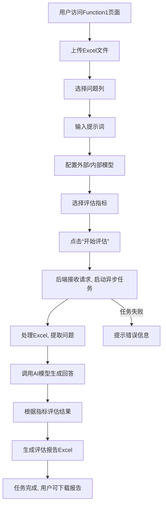

# 成研院-技支-AI测评能力平台

## 1. 项目概览

本项目是一个基于 Flask 框架开发的 AI 测评能力平台。旨在提供一个用户友好的界面，方便用户进行多种 AI 模型相关的测评任务，并记录用户操作，确保系统的可追溯性和安全性。

## 2. 功能要点

- **用户认证系统**：
    - 用户注册：新用户可以通过提供用户名、邮箱（可选）、密码和邀请码进行注册。
    - 用户登录：已注册用户可以使用用户名和密码登录系统。
    - 登出功能。
    - 密码重置功能（通过邮件）。
    - 用户个人资料编辑。
- **AI 测评功能**：
    - **Function1 (Excel处理与评估)**: 用户上传 Excel 文件，选择特定列作为问题，输入提示词，选择外部和内部模型配置，以及评估指标，系统将处理文件并给出评估结果。
    - **Function3 (AI提示词批量测试)**: 用户上传包含提示词的 Excel 文件，选择模型，系统将批量执行提示词并返回结果。
    - **Function4 (AI评AI工具)**: 用户输入文本内容，选择模型进行评估。
- **用户活动日志**：
    - 记录用户在系统中的关键操作，如登录、访问页面、执行测评任务等。
    - 管理员可以查看所有用户的活动日志，支持分页显示。
- **后台管理**：
    - （规划中）管理员可以管理用户、查看系统状态等。

## 3. 项目结构

```
AI_test_utils_v2.0/
├── TQ/                             # 包含与提示词处理相关的工具和模板
│   ├── PromptTemplate.json
│   └── tools.py
├── ZhiBiao/                        # 包含与指标计算相关的工具
│   ├── achieve.py
│   └── cilin.txt
├── app/                            # Flask 应用核心目录
│   ├── __init__.py                 # 应用工厂函数，初始化 Flask 应用及扩展
│   ├── auth/                       # 认证蓝图
│   │   ├── __init__.py
│   │   ├── forms.py                # 认证相关的 WTForms 表单
│   │   └── routes.py               # 认证相关的路由 (登录、注册、登出等)
│   ├── models.py                   # SQLAlchemy 数据库模型定义
│   ├── routes.py                   # 主应用蓝图的路由 (首页、功能页等)
│   ├── static/                     # 静态文件 (CSS, JavaScript, Images)
│   │   ├── css/
│   │   ├── images/
│   │   └── js/
│   └── templates/                  # Jinja2 HTML 模板
│       ├── admin/                  # 管理员相关页面模板
│       │   └── user_activity.html
│       ├── auth/                   # 认证相关页面模板 (login.html, register.html)
│       ├── base.html               # 基础模板，其他模板继承此模板
│       ├── function1.html          # 功能1页面模板
│       ├── function3.html          # 功能3页面模板
│       ├── function4.html          # 功能4页面模板
│       └── index.html              # 首页模板
├── config.py                       # 应用配置文件 (密钥、数据库URI、邮件服务器等)
├── instance/                       # 实例文件夹，存放运行时生成的文件，如数据库文件、日志文件
│   ├── app.db                      # SQLite 数据库文件
│   ├── app.log                     # 应用日志文件
│   ├── processed_files/            # Function1 处理后的文件存放目录
│   └── uploads/                    # 用户上传的文件存放目录
├── migrations/                     # Flask-Migrate 数据库迁移脚本
│   ├── README
│   ├── alembic.ini
│   ├── env.py
│   ├── script.py.mako
│   └── versions/                   # 迁移版本文件
├── models/                         # 存放本地AI模型文件的目录
│   ├── BAAI/
│   └── yangjhchs/
├── requirements.txt                # 项目依赖的 Python 包列表
└── run.py                          # 应用启动脚本
```

## 4. 项目架构

- **前端**：
    - HTML5
    - CSS3 (Bootstrap 5)
    - JavaScript (jQuery, AJAX for异步任务)
- **后端**：
    - Python 3.x
    - Flask 微框架
    - Flask-Login: 处理用户会话管理。
    - Flask-SQLAlchemy: ORM，与数据库交互。
    - Flask-Migrate: 管理数据库模式迁移。
    - Flask-WTF: 处理 Web 表单。
    - Flask-Bootstrap: 集成 Bootstrap 框架。
    - Werkzeug: WSGI 工具库，提供路由、请求/响应处理等。
- **数据库**：
    - SQLite: 轻量级磁盘数据库，用于开发和中小型应用。
- **核心组件职责**：
    - `app/__init__.py`: 创建和配置 Flask 应用实例，注册蓝图和扩展。
    - `app/models.py`: 定义数据库表结构（如 `User`, `UserActivityLog`）。
    - `app/routes.py`: 包含主应用的核心路由逻辑，如首页、功能页面（Function1, Function3, Function4）以及用户活动日志查看页面。
    - `app/auth/routes.py`: 处理用户认证相关的路由，如登录、注册、登出、密码重置等。
    - `app/auth/forms.py` & `app/forms.py` (若有): 定义用于数据提交和验证的表单类。
    - `config.py`: 存储应用的配置变量，如密钥、数据库连接字符串、邮件服务器设置等。
    - `run.py`: 作为应用的入口点，用于启动开发服务器。
    - `migrations/`: 存放 Alembic 生成的数据库迁移脚本，用于版本化管理数据库结构变更。

## 5. 项目流程图

### 5.1 用户认证流程

```mermaid
graph TD
    A[用户开始] --> B{注册/登录?}
    B -- 注册 --> C[填写注册信息 (用户名, 邮箱, 密码, 邀请码)]
    C --> D{验证邀请码?}
    D -- 邀请码有效 --> E[创建用户账户]
    D -- 邀请码无效 --> F[注册失败, 提示错误]
    E --> G[注册成功, 自动登录或跳转登录页]
    B -- 登录 --> H[填写登录信息 (用户名, 密码)]
    H --> I{验证用户名/密码?}
    I -- 验证成功 --> J[登录成功, 跳转首页]
    I -- 验证失败 --> K[登录失败, 提示错误]
    J --> L[用户操作 (访问功能, 登出)]
    L --> M[结束]
```

### 5.2 AI测评功能流程 (以Function1为例)



## 6. 数据库设计与使用

本项目使用 SQLAlchemy 作为 ORM，将 Python 对象映射到 SQLite 数据库中的表。数据库文件为 `instance/app.db`。

### 6.1 User 模型

`User` 模型定义了系统用户的基本信息，用于用户认证和管理。

- **表名**: `user`
- **字段**:
    - `id` (Integer, Primary Key): 用户唯一标识符。
    - `username` (String, Unique, Not Null): 用户名，用于登录。
    - `email` (String, Unique, Nullable): 用户邮箱，可选，用于密码重置等。
    - `password_hash` (String, Not Null): 存储用户密码的哈希值，保障安全。
    - `about_me` (String, Nullable): 用户个人简介。
    - `last_seen` (DateTime, Nullable): 用户最后一次登录或活动时间。
    - `is_admin` (Boolean, Default: False): 标记用户是否为管理员，用于权限控制。

### 6.2 UserActivityLog 模型

`UserActivityLog` 模型用于记录用户的操作行为，方便审计和追踪。

- **表名**: `user_activity_log`
- **字段**:
    - `id` (Integer, Primary Key): 活动日志唯一标识符。
    - `user_id` (Integer, Foreign Key to `user.id`, Nullable): 关联的用户ID。如果操作是匿名用户执行的，则可能为 `NULL`。
    - `timestamp` (DateTime, Not Null): 操作发生的时间戳。
    - `action` (String, Not Null): 描述用户执行的操作，例如 'login', 'view_index', 'access_function1' 等。
    - `details` (String, Nullable): 操作的详细信息，例如错误消息、上传文件名等。
    - `ip_address` (String, Nullable): 执行操作的IP地址。

### 6.3 数据库操作

- **初始化**: 在应用启动时，通过 Flask-SQLAlchemy 和 Flask-Migrate 进行数据库初始化和迁移。
- **增删改查**: 通过 SQLAlchemy ORM 提供的会话（`db.session`）进行数据的增、删、改、查操作。
- **关系**: `UserActivityLog` 模型通过 `user_id` 字段与 `User` 模型建立外键关系，允许通过 `activity.user` 访问关联的用户对象。

## 7. 安装与运行

### 7.1 环境准备

确保您的系统已安装 Python 3.9+ 和 pip。

### 7.2 克隆项目

```bash
git clone <项目仓库地址>
cd AI_test_utils_v2.0
```

### 7.3 创建并激活虚拟环境

推荐使用虚拟环境来管理项目依赖。

```bash
python3 -m venv venv
source venv/bin/activate  # macOS/Linux
# 或者 venv\Scripts\activate  # Windows
```

### 7.4 安装依赖

```bash
pip install -r requirements.txt
```

### 7.5 数据库初始化与迁移

首次运行或数据库模型有更新时，需要进行数据库迁移。

```bash
flask db init
flask db migrate -m "Initial migration" # 首次迁移，或根据模型变更修改信息
flask db upgrade
```

### 7.6 配置环境变量

您可能需要在运行应用前设置一些环境变量，例如 `REGISTRATION_KEY` 和邮件服务器配置。

- **REGISTRATION_KEY**: 用于用户注册的邀请码。
- **MAIL_SERVER**, **MAIL_PORT**, **MAIL_USE_TLS**, **MAIL_USERNAME**, **MAIL_PASSWORD**: 用于密码重置邮件发送。

例如，在 Linux/macOS 上：

```bash
export FLASK_APP=run.py
export FLASK_ENV=development # 开发环境
export REGISTRATION_KEY="your-secret-registration-key"
export MAIL_SERVER="smtp.example.com"
export MAIL_PORT="587"
export MAIL_USE_TLS="True"
export MAIL_USERNAME="your-email@example.com"
export MAIL_PASSWORD="your-email-password"
```

### 7.7 运行应用

```bash
flask run
```

应用通常会在 `http://127.0.0.1:5000/` 运行。您可以在浏览器中访问此地址来使用平台。